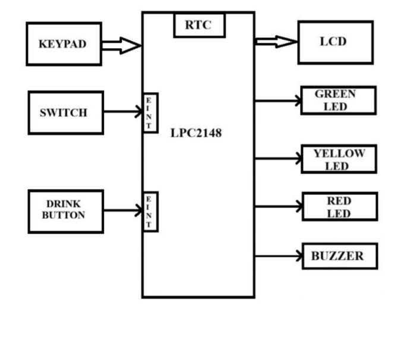
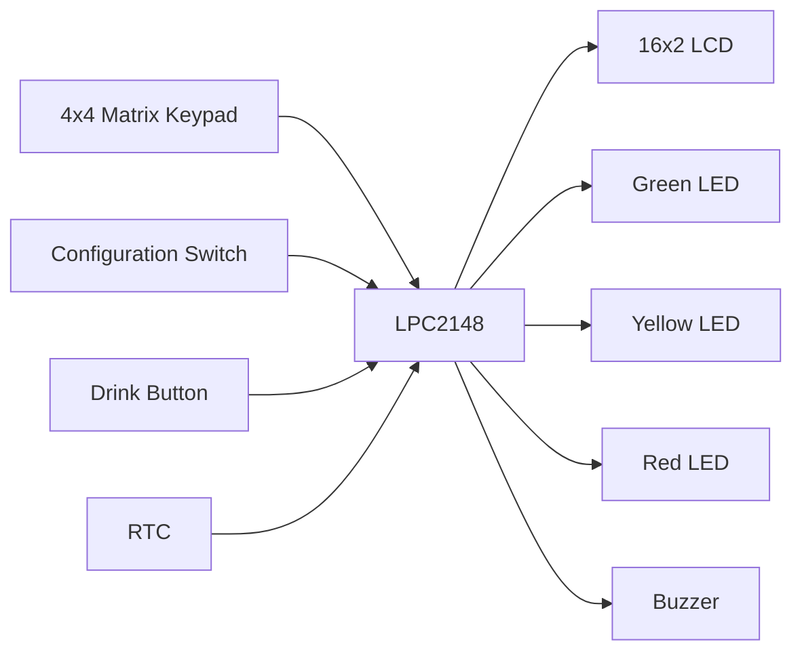
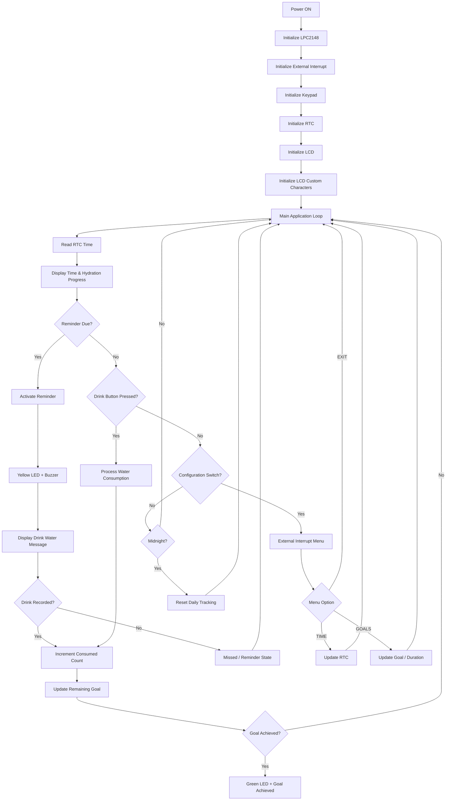
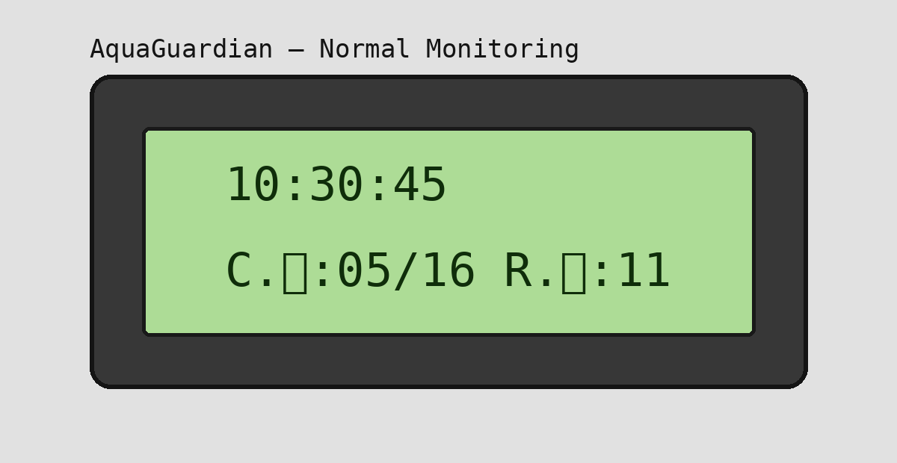
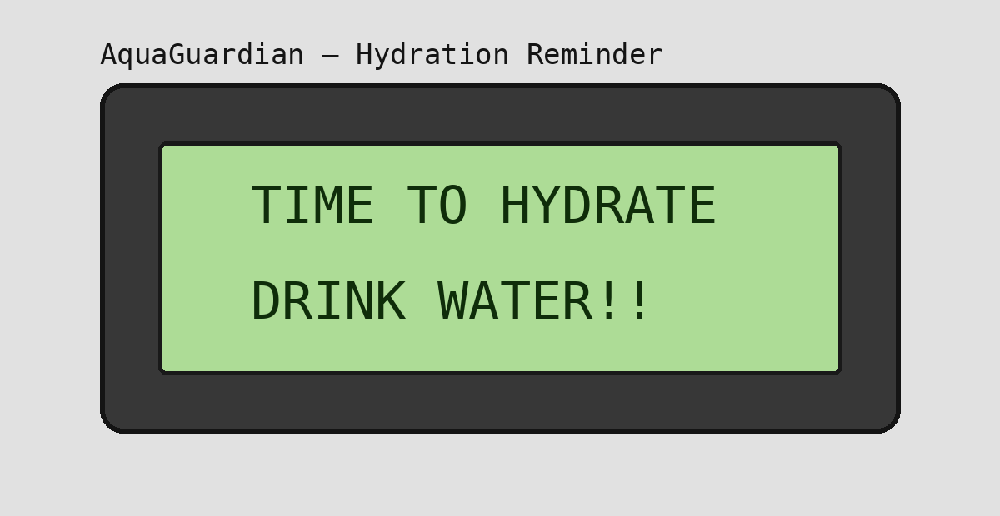
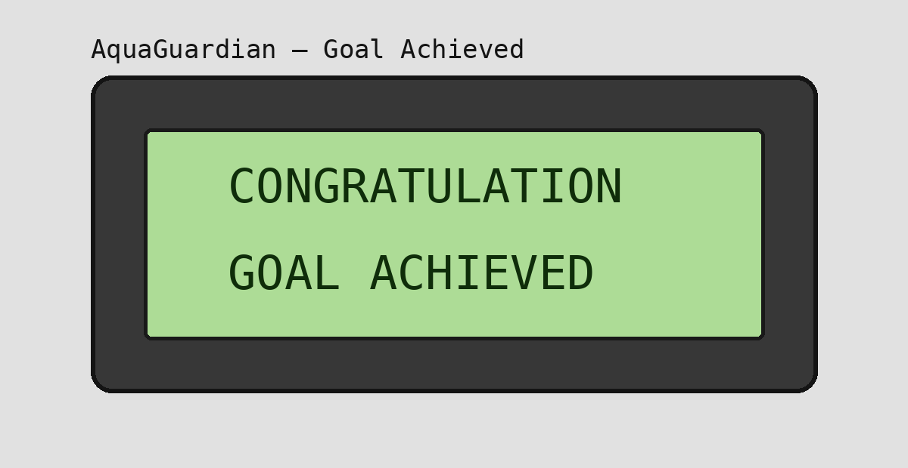
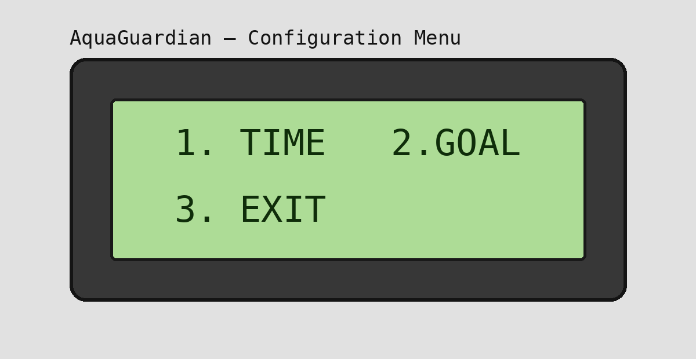
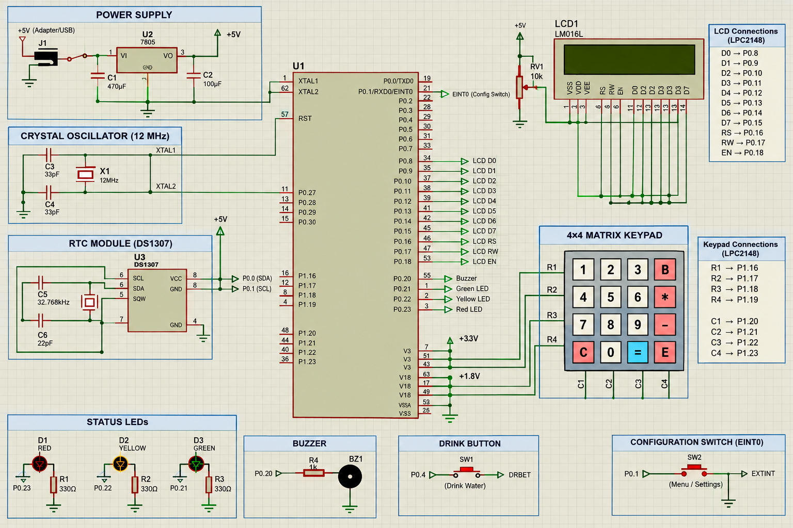
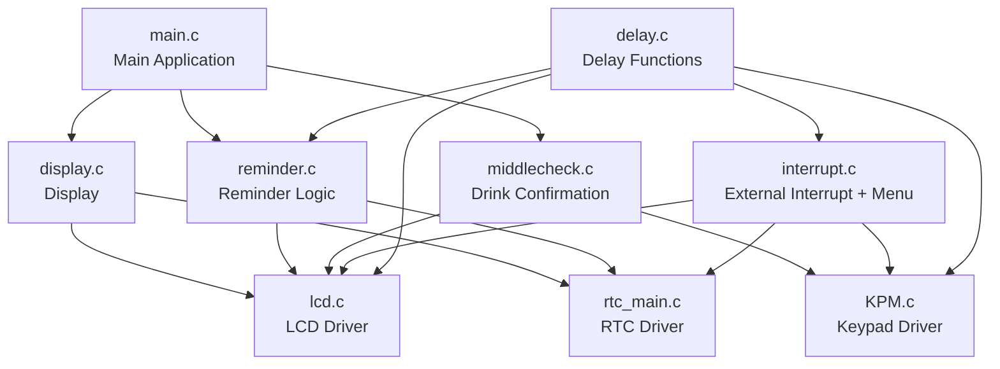

# 💧 AquaGuardian — Smart Water Drinking Reminder System

<p align="center">
  <b>RTC-Based Smart Hydration Reminder and Water Intake Monitoring System using LPC2148</b>
</p>

<p align="center">
  
</p>

---

## 📖 1. Project Overview

**AquaGuardian** is an embedded water-drinking reminder and daily hydration monitoring system developed using the **LPC2148 ARM7 microcontroller**.

The system uses a **Real-Time Clock (RTC)** to maintain time and schedule hydration reminders. It tracks the number of glasses consumed during the day and displays the current time, consumed glasses, and remaining daily target on a **16×2 LCD**.

The user can interact with the system through a **4×4 matrix keypad**, a dedicated **Drink button**, and a configuration switch connected to an **external interrupt**.

Visual and audible feedback is provided using:

- 🟢 Green LED
- 🟡 Yellow LED
- 🔴 Red LED
- 🔊 Buzzer
- 📺 16×2 LCD

The firmware is written in **Embedded C** using separate modules for peripheral drivers and application functionality.

---

## 🎯 2. Aim

To develop an **AquaGuardian Smart Water Drinking Reminder System** that automatically reminds users to drink water at regular intervals using an RTC, monitors daily water intake, tracks hydration progress, and provides LCD, LED, and audible notifications.

---

## 📌 3. Objectives

- Display the current time obtained from the RTC on the LCD.
- Generate automatic drinking reminders at regular intervals.
- Allow the user to record water consumption using a Drink button.
- Maintain a configurable daily water-intake goal.
- Compare RTC time with scheduled reminder intervals.
- Display consumed and remaining glasses on the LCD.
- Provide different LED indications for hydration status.
- Generate buzzer alerts when a reminder is due.
- Automatically reset daily water-consumption tracking at midnight.
- Provide a keypad-based menu for changing RTC and hydration settings.

---

## ✨ 4. Features

| Feature | Description |
|---|---|
| ⏰ **RTC Timekeeping** | Maintains the current time for reminder scheduling |
| 💧 **Water Intake Tracking** | Tracks the number of glasses consumed |
| 🎯 **Daily Goal** | Allows a configurable daily hydration target |
| 🔔 **Hydration Reminder** | Generates reminders at the configured interval |
| 📺 **LCD Interface** | Displays time, progress, reminders, and menu information |
| ⌨️ **4×4 Keypad** | Used for menu navigation and numeric input |
| ⚡ **External Interrupt** | Opens the configuration menu |
| 🔊 **Buzzer Alert** | Provides an audible reminder |
| 🟡 **Yellow LED** | Indicates that it is time to drink |
| 🟢 **Green LED** | Indicates that the daily goal has been achieved |
| 🔴 **Red LED** | Indicates missed/behind hydration status |
| 🌙 **Midnight Reset** | Resets daily consumption tracking for the new day |

---

# 🧩 5. System Block Diagram

The project block diagram supplied with the project documentation is included below.

<p align="center">
  
</p>

### System Blocks

```text
                    ┌───────────────┐
                    │     KEYPAD    │
                    └───────┬───────┘
                            │
                            ▼
                  ┌───────────────────┐
                  │                   │
     SWITCH ─────►│                   │─────► LCD
      EINT0       │      LPC2148      │
                  │        + RTC      │
 DRINK BUTTON ───►│                   │─────► GREEN LED
                  │                   │─────► YELLOW LED
                  │                   │─────► RED LED
                  │                   │─────► BUZZER
                  └───────────────────┘
```

The block diagram represents the main functional relationship between the LPC2148, RTC, keypad, switches, Drink button, LCD, LEDs, and buzzer.

---

# 🏗️ 6. System Architecture



---

# 🔄 7. Project Workflow



---

# 💧 8. Hydration Tracking

The firmware maintains the following values:

```text
dg = Daily Goal
cg = Consumed Glasses
rg = Remaining Glasses
```

The remaining target is calculated as:

```text
rg = dg - cg
```

For example:

```text
Daily Goal  : 16
Consumed    : 5
Remaining   : 11
```

The LCD display module presents the consumed and remaining values together with the current RTC time.

---

# ⏰ 9. Reminder System

During normal operation, the controller continuously compares the RTC time with the next scheduled reminder.

When the reminder condition is reached:

1. The reminder state is activated.
2. The LCD displays a hydration message.
3. The buzzer provides an audible alert.
4. The Yellow LED indicates the reminder state.
5. The user can acknowledge the reminder by pressing the Drink button.

The firmware uses a reminder timing mechanism based on the RTC minute value and the configured reminder interval.

---

# 📺 10. LCD Interface

The project uses a **16×2 LCD** for the main user interface.

### Normal Monitoring

The LCD displays:

- Current RTC time
- Consumed glasses
- Daily goal
- Remaining glasses

<p align="center">
  
</p>

### Hydration Reminder

The firmware displays:

```text
TIME TO HYDRATE
DRINK WATER!!
```

<p align="center">
  
</p>

### Goal Achieved

When the daily goal is achieved:

```text
CONGRATULATION
GOAL ACHIEVED
```

<p align="center">
  
</p>

### Configuration Menu

The external interrupt opens the configuration menu:

```text
1. TIME   2. GOALS
3. EXIT
```

<p align="center">
  
</p>

> **Note:** The LCD images above are documentation mockups based on the messages implemented in the firmware. Replace them with photographs of the actual LCD output when available.

---

# ⌨️ 11. 4×4 Keypad

The keypad driver uses a row/column scanning technique.

```text
+---+---+---+---+
| 1 | 2 | 3 | B |
+---+---+---+---+
| 4 | 5 | 6 | * |
+---+---+---+---+
| 7 | 8 | 9 | - |
+---+---+---+---+
| C | 0 | = | E |
+---+---+---+---+
```

### Numeric Input

- `0–9` → Enter numeric values
- `B` → Backspace
- `E` → Confirm input
- Invalid values → Rejected and requested again

---

# ⚡ 12. External Interrupt & Configuration Menu

A dedicated switch activates **EINT0** and opens the configuration menu.

The firmware configures EINT0 on **P0.1**.

The menu provides:

```text
1. TIME
2. GOALS
3. EXIT
```

### Time Configuration

The user can update:

- Hours: `0–23`
- Minutes: `0–59`

The firmware validates the entered values before updating the RTC.

### Goal Configuration

The user can modify:

- Daily hydration goal
- Reminder duration/interval

The firmware checks the entered values before applying them.

---

# 🔌 13. LCD Interface Connections

The LCD driver configures the following LPC2148 pins:

| LCD Signal | LPC2148 |
|---|---|
| D0 | P0.8 |
| D1 | P0.9 |
| D2 | P0.10 |
| D3 | P0.11 |
| D4 | P0.12 |
| D5 | P0.13 |
| D6 | P0.14 |
| D7 | P0.15 |
| RS | P0.16 |
| RW | P0.17 |
| EN | P0.18 |

These connections are taken directly from the LCD initialization code.

---


# 🔌 14. Circuit Schematic

A Proteus-style circuit representation is included below to show the major hardware interfaces of the AquaGuardian system.

<p align="center">
  
</p>

### Main Interfaces

| Interface | Connection / Function |
|---|---|
| LPC2148 | Main ARM7 microcontroller |
| 16×2 LCD | Display and user interface |
| 4×4 Keypad | Menu navigation and numeric input |
| RTC | Timekeeping and reminder scheduling |
| EINT0 Switch | Opens configuration menu |
| Drink Button | Records water consumption |
| Green LED | Goal achieved indication |
| Yellow LED | Hydration reminder indication |
| Red LED | Missed/behind hydration indication |
| Buzzer | Audible reminder |

> **Important:** The schematic illustration is intended for documentation/visualization. The exact electrical pin mapping should always be verified against the final Proteus schematic, header definitions, and physical hardware before building the circuit.

# 🧰 15. Hardware Requirements

| Component | Purpose |
|---|---|
| **LPC2148** | Main ARM7 microcontroller |
| **16×2 LCD** | Display interface |
| **4×4 Matrix Keypad** | Menu and numeric input |
| **RTC** | Real-time clock and scheduling |
| **Green LED** | Goal achieved |
| **Yellow LED** | Reminder state |
| **Red LED** | Missed/behind hydration indication |
| **Drink Button** | Records water consumption |
| **Configuration Switch** | Activates EINT0 |
| **Buzzer** | Audible reminder |
| **USB-UART / DB-9 Cable** | Programming/communication |

---

# 💻 16. Software Requirements

- Embedded C
- LPC2148 development environment
- ARM7-compatible compiler/IDE
- Flash Magic
- LPC2148 hardware board

---

# 🧠 17. Software Architecture



---

# 📁 18. Project Structure

Recommended GitHub repository structure:

```text
AquaGuardian/
│
├── inc/
│   ├── header.h
│   ├── types.h
│   ├── define.h
│   ├── delay.h
│   ├── lcd.h
│   ├── lcd_defines.h
│   ├── KPM.h
│   ├── KPM_defines.h
│   └── rtc_main.h
│
├── src/
│   ├── main.c
│   ├── display.c
│   ├── interrupt.c
│   ├── KPM.c
│   ├── lcd.c
│   ├── rtc_main.c
│   ├── reminder.c
│   ├── middlecheck.c
│   └── delay.c
│
├── docs/
│   └── images/
│       ├── block-diagram.png
│       ├── lcd-normal.png
│       ├── lcd-reminder.png
│       ├── lcd-goal-achieved.png
│       └── lcd-menu.png
│
└── README.md
```

---

# 🧩 19. Source File Description

| File | Responsibility |
|---|---|
| `main.c` | Main application loop and hydration state management |
| `display.c` | Displays RTC time and hydration information |
| `interrupt.c` | EINT0 configuration and menu handling |
| `KPM.c` | Keypad scanning and numeric input |
| `lcd.c` | 16×2 LCD driver |
| `rtc_main.c` | RTC initialization and time/date functions |
| `reminder.c` | Reminder logic, buzzer and LED handling |
| `middlecheck.c` | Drink confirmation and consumption update |
| `delay.c` | Software delay routines |

---

# 🔧 20. Embedded Concepts Demonstrated

This project demonstrates practical embedded-system concepts including:

- ARM7 / LPC2148 programming
- Embedded C
- GPIO configuration
- Bit manipulation
- LCD interfacing
- 4×4 matrix keypad scanning
- RTC programming
- External interrupt handling
- VIC interrupt configuration
- LED and buzzer control
- Input validation
- Modular firmware development
- Time-based event scheduling
- LCD CGRAM/custom characters
- State-based application logic

---

# 🧪 21. Testing

| Test Case | Expected Result |
|---|---|
| Power ON | Peripheral initialization completes |
| RTC | Current time is available |
| LCD | Time and hydration information appear |
| Keypad | Pressed key is detected |
| Drink Button | Consumption count increases |
| Reminder | Buzzer + Yellow LED + LCD reminder |
| Drink Acknowledgement | Progress updates |
| Goal Achieved | Green LED + achievement message |
| Configuration Switch | EINT0 menu opens |
| Invalid Hour | Input rejected |
| Invalid Minute | Input rejected |
| Invalid Goal | Input rejected |
| Midnight | Daily tracking resets |

---

# 🛠️ 22. Troubleshooting

### LCD not displaying

Check:

- LCD power and contrast.
- LCD data/control connections.
- GPIO direction configuration.
- LCD initialization sequence.

### Keypad not responding

Check:

- Row/column connections.
- GPIO configuration.
- Keypad definitions.
- Debounce timing.

### RTC not working correctly

Check:

- RTC clock source.
- RTC initialization.
- Time-setting logic.
- Hardware clock configuration.

### Reminder not triggering

Check:

- RTC minute/second values.
- Reminder interval.
- `alarm` and `check_al` variables.
- Buzzer and LED connections.

### Configuration menu not opening

Check:

- EINT0 connection on P0.1.
- VIC interrupt configuration.
- External interrupt configuration.
- Interrupt status clearing.

---

# 🎯 23. Applications

AquaGuardian can be used as a foundation for:

- Personal hydration reminder devices
- Smart desk wellness devices
- Embedded healthcare assistants
- Elderly-care reminder systems
- Workplace hydration systems
- Future IoT-based hydration monitoring

---

# 🔮 24. Future Improvements

Possible future improvements include:

- Automatic water-volume measurement.
- EEPROM/Flash storage for configuration.
- Bluetooth connectivity.
- Wi-Fi/IoT connectivity.
- Mobile application integration.
- Cloud-based hydration history.
- User-specific hydration profiles.
- Daily/weekly hydration statistics.
- Low-power operation.
- Personalized reminder schedules.

---

# 📸 25. Project Images

The `docs/images/` directory is intended for project photographs and screenshots.

Recommended additions:

```text
docs/images/
├── block-diagram.png
├── hardware.jpg
├── circuit.jpg
├── lcd-normal.jpg
├── lcd-reminder.jpg
└── lcd-goal-achieved.jpg
```

Example:

```markdown

```

---

# 📚 26. Documentation

The project documentation defines AquaGuardian as a smart water-drinking reminder system that combines:

```text
RTC Scheduling
       +
Hydration Tracking
       +
LCD Display
       +
Keypad Interface
       +
External Interrupt
       +
LED Indication
       +
Buzzer Alert
       ↓
AquaGuardian
```

---

# 👨‍💻 27. Author

**Joel Ughade**

Electronics & Telecommunication Engineer  
Embedded Systems & IoT Enthusiast

---

# 📜 28. License

This project is intended for educational, learning, and portfolio purposes.

If you reuse or modify the project, please provide appropriate attribution to the original author.

---

<p align="center">
  <b>💧 AquaGuardian — Stay Hydrated, Stay Healthy.</b>
</p>
