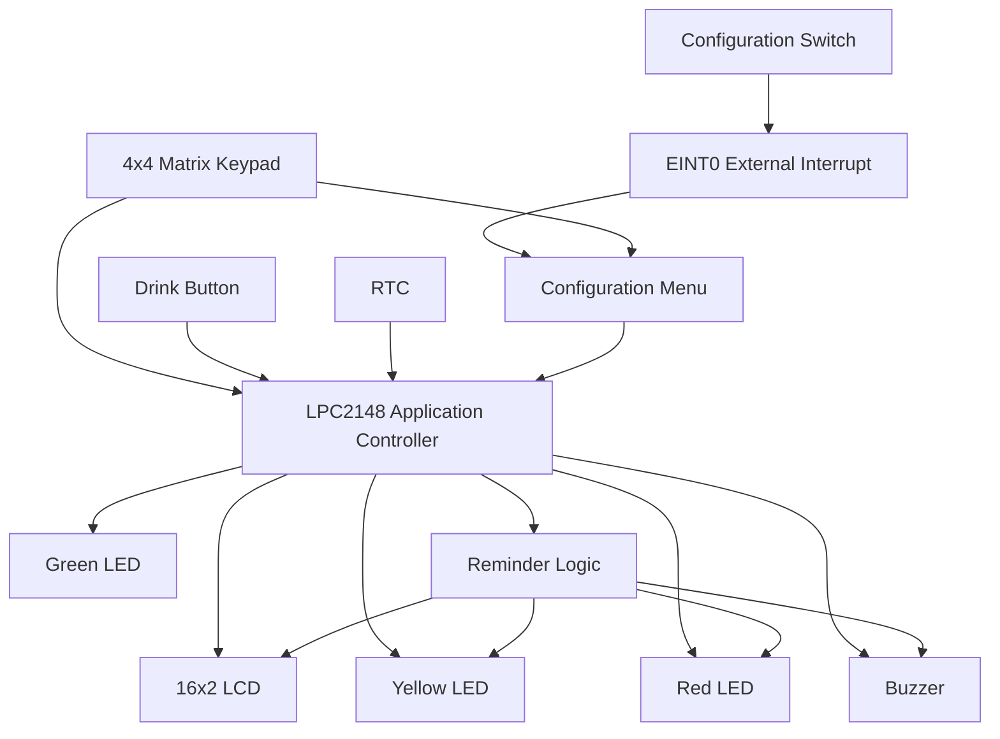
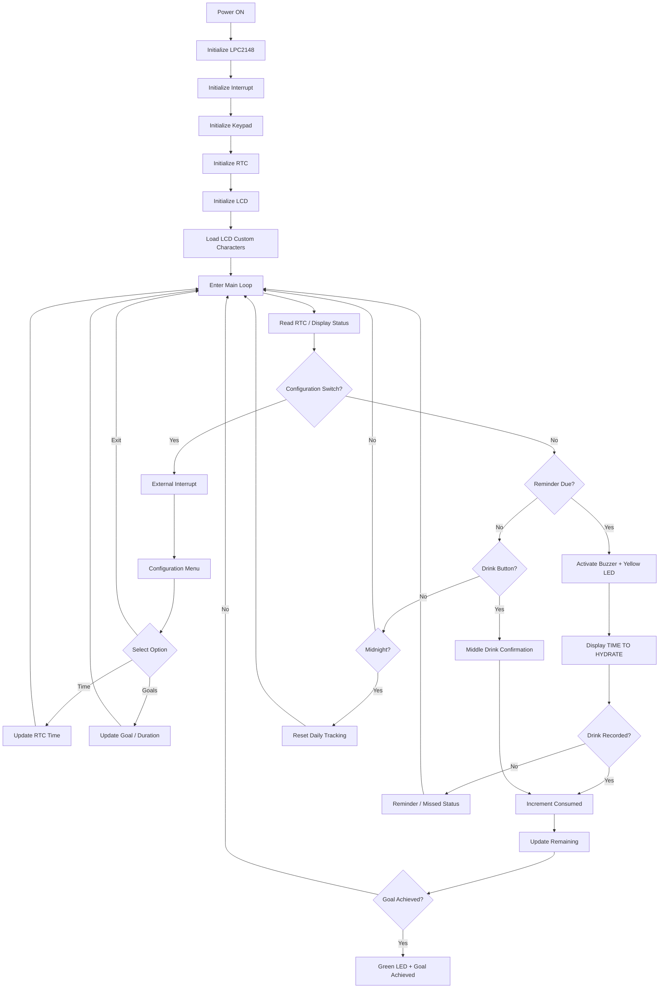
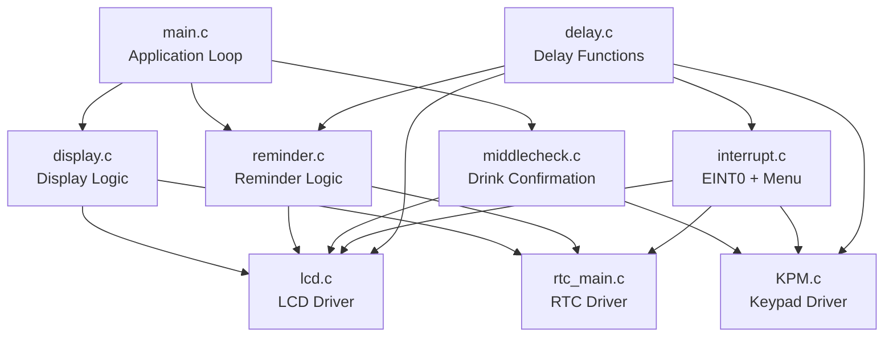

# 💧 AquaGuardian — Smart Water Drinking Reminder System

<p align="center">
  <b>RTC-Based Hydration Monitoring & Reminder System using LPC2148</b>
</p>

<p align="center">
  
</p>

AquaGuardian is an embedded hydration-monitoring system developed around the **NXP LPC2148 ARM7 microcontroller**. It uses a Real-Time Clock (RTC) to schedule drinking reminders, tracks the user's daily water intake, displays hydration information on a 16×2 LCD, and provides visual and audible alerts through LEDs and a buzzer.

The firmware is written in **Embedded C** and organized into separate peripheral/application modules for the LCD, keypad, RTC, delays, external interrupt, display logic, reminder logic, and hydration confirmation.

---

## 📖 1. Project Overview

### Objective

The objective of AquaGuardian is to encourage regular water consumption by automatically reminding the user at scheduled intervals and tracking progress toward a configurable daily hydration goal.

### Problem Addressed

People may forget to drink water regularly during work, study, or daily activities. AquaGuardian provides a simple standalone embedded solution that combines:

- RTC-based scheduling
- Automatic hydration reminders
- Daily water-intake tracking
- LCD-based information
- LED status indication
- Audible alerts
- Keypad-based configuration
- External-interrupt-driven menu access

### Scope

The current system can:

- Maintain and display the current RTC time.
- Generate periodic hydration reminders.
- Record water consumption through a Drink button.
- Maintain a configurable daily goal.
- Display consumed and remaining glasses.
- Allow RTC and goal settings to be modified through a keypad menu.
- Indicate hydration status using Green, Yellow, and Red LEDs.
- Use a buzzer for reminder alerts.
- Reset daily tracking at midnight.

---

## ✨ 2. Features & Functionality

| Feature | Description |
|---|---|
| ⏰ RTC Timekeeping | Maintains current time and provides the timing reference for reminders |
| 💧 Intake Tracking | Counts confirmed glasses consumed during the day |
| 🎯 Daily Goal | Configurable number of glasses/goals |
| 🔔 Reminder System | Activates a hydration reminder at the scheduled interval |
| 📺 16×2 LCD | Displays time, progress, menus, and reminder messages |
| ⌨️ 4×4 Keypad | Used for configuration and numeric input |
| ⚡ External Interrupt | Opens the configuration menu through a dedicated switch |
| 🔊 Buzzer | Provides audible reminder feedback |
| 🟡 Yellow LED | Indicates reminder / time-to-drink state |
| 🟢 Green LED | Indicates goal achieved |
| 🔴 Red LED | Indicates missed/behind hydration state |
| 🌙 Midnight Reset | Resets the daily tracking state for a new day |

---

## 📊 3. Hydration Tracking Model

The application maintains three main values:

```text
dg = Daily Goal
cg = Consumed Glasses
rg = Remaining Glasses
```

The remaining target is calculated as:

```text
rg = dg - cg
```

Example:

```text
Daily Goal      = 16
Consumed        = 5
Remaining       = 11
```

The LCD can present the progress in a compact format.

---

## 🧩 4. System Architecture



GitHub supports Mermaid diagrams directly inside Markdown code fences, so the architecture can render on the repository page without creating a separate diagram image. citeturn0search1turn0search4

---

## 🔌 5. Hardware Configuration

The project documentation identifies the following hardware:

| Hardware | Purpose |
|---|---|
| **LPC2148** | Main ARM7 microcontroller |
| **16×2 LCD** | User interface and system information |
| **4×4 Matrix Keypad** | Menu navigation and numeric input |
| **RTC** | Timekeeping and reminder scheduling |
| **Green LED** | Goal achieved indication |
| **Yellow LED** | Hydration reminder indication |
| **Red LED** | Missed/behind hydration indication |
| **Drink Button** | Records water consumption |
| **Configuration Switch** | Activates external interrupt/menu |
| **Buzzer** | Audible hydration alert |
| **USB-UART / DB-9** | Programming/serial interface |

> **Pin mapping:** The exact application pin mapping is defined by the project's header/definition files. It should be documented here from the final hardware schematic rather than inferred.

---

## 🔄 6. End-to-End Flow



---

## 🖥️ 7. LCD Interface

### Normal Monitoring

The LCD presents the current time and hydration progress.

<p align="center">
  
</p>

### Hydration Reminder

When the reminder condition occurs, the LCD displays:

```text
TIME TO HYDRATE
DRINK WATER!!
```

<p align="center">
  
</p>

### Goal Achieved

When the consumed count reaches the daily goal:

```text
CONGRATULATION
GOAL ACHIEVED
```

<p align="center">
  
</p>

### Configuration Menu

The external-interrupt menu provides options such as:

```text
1. TIME   2. GOALS
3. EXIT
```

<p align="center">
  
</p>

> **Note:** These LCD visuals are README demonstration/mockup images based on the messages implemented in the firmware. Replace them with photographs of the actual hardware LCD output when available.

---

## ⌨️ 8. Keypad Layout

The firmware uses the following 4×4 keypad lookup table:

```text
+---+---+---+---+
| 1 | 2 | 3 | B |
+---+---+---+---+
| 4 | 5 | 6 | * |
+---+---+---+---+
| 7 | 8 | 9 | - |
+---+---+---+---+
| C | 0 | = | E |
+---+---+---+---+
```

The keypad driver scans rows and columns and maps the detected position to the corresponding key.

For numeric entry:

- `0–9` → Enter digits
- `B` → Backspace
- `E` → Confirm / Enter
- Invalid input → Rejected and re-prompted

---

## ⚙️ 9. Configuration Menu

A dedicated switch connected to the external interrupt opens the configuration interface.

### TIME

The user can modify:

```text
Hours   : 0–23
Minutes : 0–59
```

### GOALS

The user can modify the hydration reminder configuration, including:

- Reminder duration/interval
- Number of daily goals

The firmware validates user input before applying the new value.

---

## 🧠 10. Software Architecture



### Module Responsibilities

| Module | Responsibility |
|---|---|
| `main.c` | Main application loop and overall hydration state management |
| `display.c` | Displays RTC time and hydration progress |
| `interrupt.c` | EINT0 configuration and configuration menu |
| `KPM.c` | 4×4 keypad scanning and numeric input |
| `lcd.c` | Low-level 16×2 LCD driver |
| `rtc_main.c` | RTC initialization, time/date read/write and display |
| `reminder.c` | Reminder timing, buzzer and LED handling |
| `middlecheck.c` | Handles water consumption confirmation |
| `delay.c` | Software delay routines |

---

## 📁 11. Repository Structure

Recommended GitHub structure:

```text
AquaGuardian/
│
├── inc/
│   ├── header.h
│   ├── types.h
│   ├── define.h
│   ├── delay.h
│   ├── lcd.h
│   ├── lcd_defines.h
│   ├── KPM.h
│   ├── KPM_defines.h
│   └── rtc_main.h
│
├── src/
│   ├── main.c
│   ├── display.c
│   ├── interrupt.c
│   ├── KPM.c
│   ├── lcd.c
│   ├── rtc_main.c
│   ├── reminder.c
│   ├── middlecheck.c
│   └── delay.c
│
├── docs/
│   ├── images/
│   │   ├── lcd-normal.png
│   │   ├── lcd-reminder.png
│   │   ├── lcd-goal-achieved.png
│   │   └── lcd-menu.png
│   └── project-report.pdf
│
└── README.md
```

> Keep the actual filenames and folders consistent with your final GitHub repository. If your `.h` files are currently in the root directory, you can move them into `inc/` after updating the project include paths.

---

## 🧪 12. Testing & Validation

| Test Case | Expected Result |
|---|---|
| Power ON | All configured peripherals initialize |
| RTC initialization | Current time becomes available |
| LCD test | Time and hydration information are displayed |
| Keypad test | Pressed key is detected correctly |
| Drink button | Consumed count increases |
| Reminder time reached | Buzzer + Yellow LED + LCD reminder |
| Drink acknowledged | Consumption and remaining target update |
| Daily goal reached | Goal-achieved message + Green LED |
| Configuration switch | EINT0 menu opens |
| Invalid hour | Input rejected |
| Invalid minute | Input rejected |
| Invalid goal | Input rejected |
| Midnight | Daily tracking values reset |

---

## 🛠️ 13. Troubleshooting

### LCD is blank

Check:

- LCD power and contrast.
- LCD data/control connections.
- GPIO direction configuration.
- LCD initialization sequence.
- Correct header definitions.

### Keypad does not respond

Check:

- Row/column wiring.
- GPIO direction.
- Keypad pin definitions.
- Pull-up/pull-down requirements.
- Debounce timing.

### RTC time is incorrect

Check:

- RTC clock source.
- 32.768 kHz crystal configuration where applicable.
- RTC initialization.
- Time-setting routine.
- LPC2148 power/backup configuration.

### Reminder does not trigger

Check:

- RTC minute/second values.
- Reminder interval configuration.
- `alarm` and `check_al` state.
- Daily goal condition.
- Buzzer and Yellow LED GPIO configuration.

### External interrupt does not open the menu

Check:

- EINT0 pin configuration.
- VIC interrupt configuration.
- Interrupt vector assignment.
- `EXTMODE` configuration.
- Interrupt status clearing.

---

## 💻 14. Development Environment

### Microcontroller

**NXP LPC2148 — ARM7TDMI-S**

### Programming Language

**Embedded C**

### Programming Tool

**Flash Magic**

### Interfaces / Peripherals

- GPIO
- RTC
- 16×2 LCD
- 4×4 Matrix Keypad
- External Interrupt
- LEDs
- Buzzer
- Push Buttons

---

## 🧱 15. Embedded Concepts Demonstrated

This project demonstrates practical embedded-system concepts:

- ARM7/LPC2148 architecture
- Embedded C programming
- GPIO configuration
- Bit manipulation
- LCD interfacing
- Matrix keypad scanning
- RTC programming
- External interrupt handling
- Interrupt vector configuration
- Buzzer and LED control
- User-interface design
- Input validation
- Modular firmware design
- State-based application logic
- Custom LCD characters / CGRAM
- Time-based event scheduling

---

## 🎯 16. Applications

AquaGuardian can serve as a foundation for:

- Personal hydration reminder devices
- Embedded healthcare assistants
- Smart desk accessories
- Elderly-care reminder systems
- Office/workplace wellness devices
- IoT-based hydration monitoring systems

---

## 🔮 17. Future Improvements

Possible extensions include:

- Automatic water-volume measurement using a flow/level sensor.
- EEPROM/Flash storage for persistent user settings.
- Bluetooth or Wi-Fi connectivity.
- Mobile application integration.
- Cloud-based hydration history.
- Multiple user profiles.
- Personalized hydration schedules.
- Low-power sleep modes.
- Daily/weekly hydration statistics.
- Automatic recommended-intake calculation.

---

## 📸 18. Project Images

Add actual project photographs here when available:

```text
docs/images/
├── hardware.jpg
├── circuit.jpg
├── lcd-normal.jpg
├── lcd-reminder.jpg
└── block-diagram.png
```

Example Markdown:

```markdown


```

---

## 📚 19. Documentation

The project documentation covers the system objective, hardware/software requirements, block diagram, workflow, hydration tracking, LED states, buzzer alerts, configuration menu, and daily reset behavior.

---

## 👨‍💻 20. Author

**Joel Ughade**

Electronics & Telecommunication Engineer  
Embedded Systems & IoT Enthusiast

---

## ⭐ Project Summary

```text
RTC
 │
 ▼
LPC2148 ───────► LCD
 │
 ├─────────────► Keypad
 │
 ├─────────────► Drink Button
 │
 ├─────────────► Green LED
 │
 ├─────────────► Yellow LED
 │
 ├─────────────► Red LED
 │
 └─────────────► Buzzer
```

**AquaGuardian combines RTC-based scheduling, Embedded C, LCD interfacing, keypad input, external interrupts, hydration tracking, LED status indication, and audible alerts into a compact LPC2148 embedded application.**

---

## 📜 License

This project is intended for educational, learning, and portfolio purposes.

If you reuse or modify the project, please provide appropriate attribution to the original author.
